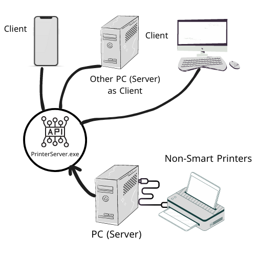

# Remote Printing Server for Non-Smart Printers

This project enables remote printing from any device on the same network to a non-smart printer (e.g., HP LaserJet Professional P1102). It allows users to upload files (PDF, JPG, JPEG, PNG) through a web interface and send them to the printer.

## Features
- Accepts file uploads in **PDF**, **JPG**, **JPEG**, and **PNG** formats.
- Automatically processes the file for printing.
- Sends print commands to the specified printer on the network.
- Designed to make non-smart printers accessible and manageable remotely.

## How It Works
1. Users access a simple web interface to upload their file.
2. The server receives the file, processes it, and sends it to the designated printer.
3. The file is printed directly without needing physical access to the printer.

## Technologies Used
- **Programming Languages**: C#
- **Framework**: ASP.NET Core
- **Libraries**:
  - **System.Drawing.Printing**: for sending print commands to the printer.
  - **PdfiumViewer**: for handling PDF files.
- **Frontend**: HTML, CSS, JavaScript (for the file upload interface).
- **File Handling**: IFormFile, FileStream for managing file uploads and storage.
